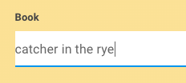
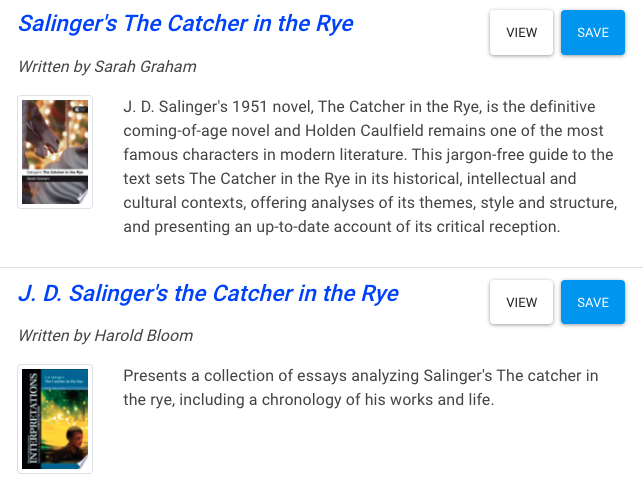
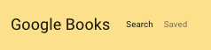
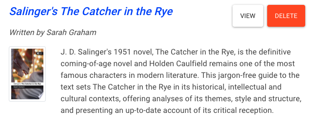

## What it does

The Google Books Search is a MERN app that accesses the Google Books database. The user can save books returned from the search to a MongoDB database. Saved books can be viewed and removed.

## How it works

### Search

When the app is loaded a __Search__ box presents the user with a text box to enter a book title, author, or any relevant search string. Click the __Search__ button to initiate the search. An API to the Google-Books database transfers the request to the server for processing.

Search results are listed in the __Results__ box. Each returned item lists the book title, author, image, and brief annotation.

The __View__ button re-directs the user to the Google Books page.

The __Save__ button saves the book's data to the MongoDb database.

### Save

To view saved books, click on the Saved item in the Navbar.

The __View__ button re-directs the user to the Google Books page.

The __Delete__ button removes the book from the MongoDB database.

## Technology

